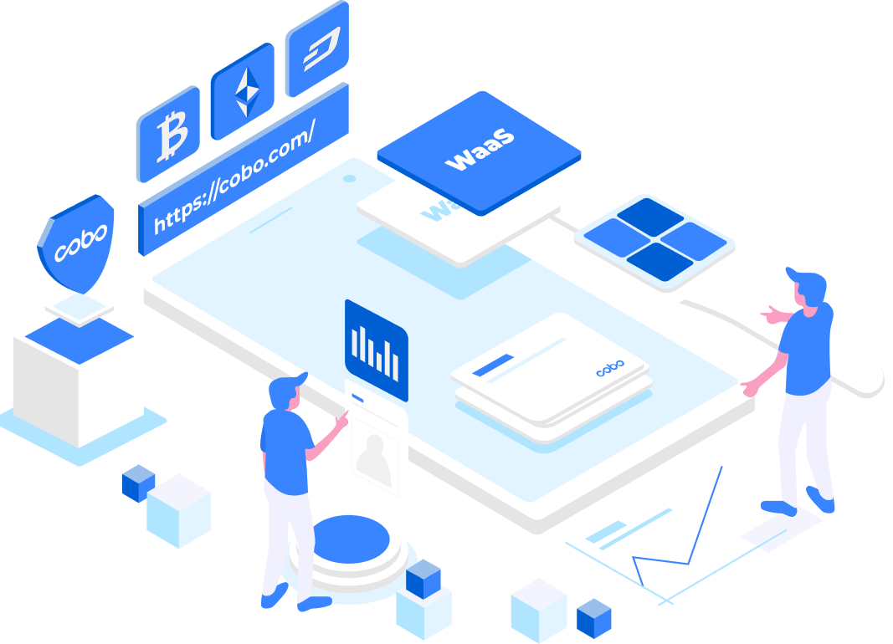

<p align="center">
  <a href="https://www.cobo.com/developers">
    
  </a>
</p>

<div align="center">
  <h1>Cobo Developer Hub</h1>

  <br />
  <br />
  <a href="https://www.cobo.com/developers/overview/custodial-wallet">Custodial Wallet</a>
  <span>&nbsp;&nbsp;•&nbsp;&nbsp;</span>
  <a href="https://www.cobo.com/developers/overview/mpc-wallet/mpc-introduction">MPC Wallet</a>
  <span>&nbsp;&nbsp;•&nbsp;&nbsp;</span>
  <a href="https://www.cobo.com/developers/overview/smart-contract-wallet/cobosafe">Smart Contract Wallet</a>
  <span>&nbsp;&nbsp;•&nbsp;&nbsp;</span>
  <a href="https://www.cobo.com/web3/channel/news">News</a>
  <span>&nbsp;&nbsp;•&nbsp;&nbsp;</span>
  <a href="https://discord.gg/FaZwQ9WYpj">Discord</a>
  <span>&nbsp;&nbsp;•&nbsp;&nbsp;</span>
  <a href="https://twitter.com/Cobo_Global">Twitter</a>
  <br />

</div>

<br />

<div align="center">
  <h2>About Cobo</h2>
  <p align="left">
  Cobo is a globally trusted leader in digital asset custody solutions.
  As the world’s first omni-custody platform, Cobo offers the full spectrum of solutions from full custody,
  co-managed MPC custody, to fully decentralized custody as well as wallet-as-a-service,
  advanced DeFi investment tools and an off-exchange settlement network.
  Trusted by over 500 institutions with billions in assets under custody,
  Cobo inspires confidence in digital asset ownership by enabling safe and efficient management of digital assets and interactions with Web 3.0.
  Cobo is SOC2 Type 1 and Type 2-compliance-certified and licensed in 5 jurisdictions.
  </p>
</div>

<br/>

## Get started

The Developer Hub mainly includes the following resources.:

- **[Custodial Wallet](https://www.cobo.com/developers/overview/custodial-wallet)**. Cobo Custodial Wallet is built upon bank-grade security technologies such as Hardware Security Modules (HSM) and Intel Software Guard Extensions (SGX), that is battle tested in traditional financial industry.
- **[MPC Wallet](https://www.cobo.com/developers/overview/mpc-wallet/mpc-introduction)**. Cobo MPC Wallet leverages advanced Multi-Party Computation (MPC) technology to implement a Threshold Signature Scheme (TSS).
- **[Smart Contract Wallet](https://www.cobo.com/developers/overview/smart-contract-wallet/cobosafe)**. Cobo’s Smart Contract Wallet solution, dubbed as “Cobo Safe”, is a smart contract based access control framework on EVM compatible blockchains.
  <br />

## Contributing

PRs are always welcome! To get started, follow this guide to build Cobo Developer Hub from
source on your local machine.

Step 1.clone

```
git clone git@github.com:CoboGlobal/developer-site.git
```

<br />

Step 2. Install Mintlify on your OS:

```
npm i -g mintlify
```

<br />

Step 3. Go to the docs directory (where you can find mint.json) and run the following command:

```
mintlify dev
```

The documentation website is now available at http://localhost:3000.

<br />

Step 4. Developer Hub is built on mintlify, its syntax is very similar to markdown

[Basic Syntax 👉](https://mintlify.com/docs/introduction)

<br />

Step 5. When you have completed the modifications locally, and after previewing with no issues,
please proceed with the standard Fork & Pull Request process for submission.

[How to Fork & Pull Request 👉](https://gist.github.com/Chaser324/ce0505fbed06b947d962)
<br />

## Contact us

[Join the discord 👉](https://discord.gg/FaZwQ9WYpj)
<br />
[Join the telegram 👉](https://t.me/coboglobal)
<br />
[Follow our twitter 👉](https://twitter.com/Cobo_Global)
<br />
[Follow our linkedln 👉](https://www.linkedin.com/company/cobo-global/)

## License

The code in this repository is developed and distributed under the
GPL 3.0 license. See [LICENSE](LICENSE) for details.
