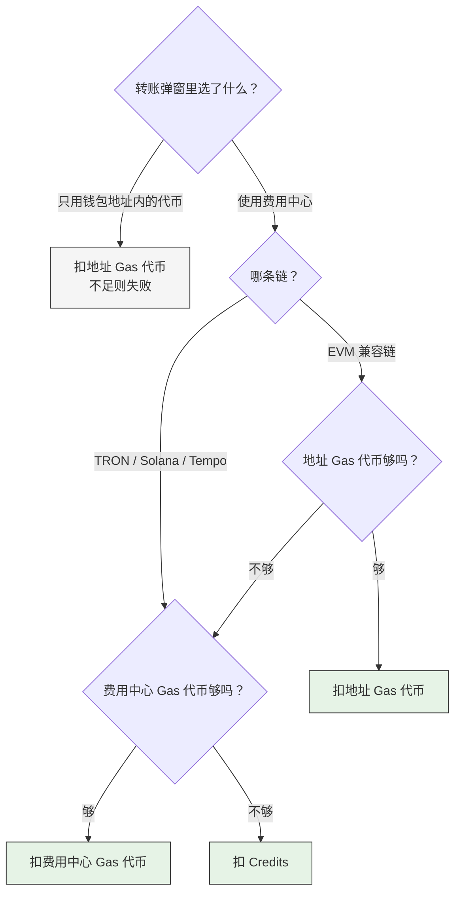

链上手续费可能来自三处：钱包地址内的 Gas 代币、费用中心的 Gas 代币、费用中心的 Credits。实际从哪一处扣除，由您的配置决定；Portal 页面转账与 API 交易的配置不同。

## Portal 页面发起的转账

发起转账时，弹窗中可以选择由谁支付这笔手续费——「使用费用中心」或「只用钱包地址内的代币」：

| 链 | 使用费用中心 | 只用钱包地址内的代币 |
|---|---|---|
| EVM 兼容链 | 地址内的 Gas 代币足够时用地址的；不足时由费用中心支付 | 只用地址内的 Gas 代币，不足则交易失败 |
| TRON、Solana、Tempo | **直接由费用中心支付，完全不动用地址内的 Gas 代币** | 只用地址内的余额，不足则交易失败 |

支付方式**只能在每次转账的弹窗中选择，且只影响当次转账**，费用中心没有针对 Portal 转账的全局开关。

## 通过 API 发起的交易

手续费如何支付，由请求中的 `auto_fuel` 参数决定：

| 取值 | 行为 |
|---|---|
| `ProActiveAutoFuel` | 始终由费用中心支付，不动用地址内的 Gas 代币 |
| `PassiveAutoFuel` | 地址内的 Gas 代币足够时用地址的，不足时由费用中心支付。TRON、Solana、Tempo 不支持 |
| `UsePortalPreference` | 沿用设置页中配置的各链代付规则 |
| `DisableAutoFuel` | 不使用费用中心，由地址自行支付，不足则交易失败 |

**不传该参数时默认为 `UsePortalPreference`**，即沿用设置页的配置。显式传入其他取值时，以请求为准，不读取页面配置。

### 高级设置中的两项配置

在费用中心点击**设置**页签、展开**高级设置**，其中两项**仅在 API 交易传入 `UsePortalPreference`（或不传该参数）时生效**：

- **各链代付规则**：逐链设置是否由费用中心代付。EVM 兼容链可选「只用钱包地址」「地址余额不足时代付」「始终由费用中心代付」三档；TRON、Solana、Tempo 只有「只用钱包地址」与「由费用中心代付」两档。
- **代付时从哪种余额扣费**：可选「Gas 代币优先，不足时用 Credits」或「仅使用 Gas 代币」；选后者时，Gas 代币不足会让该链的 API 交易失败。

## 一笔手续费只由一个来源全额支付

<Warning>
**某个来源不够时，是整笔换下一个来源支付，而不是补上差额。**

举例：地址里有 0.003 ETH，这笔交易需要 0.005 ETH。费用中心不会补那 0.002，而是**将 0.005 全额支付**，地址里原有的 0.003 分文未动。

由费用中心支付时同理：先扣该链对应的 Gas 代币，余额不足时改由 Credits 支付，不会先扣掉 Gas 代币再用 Credits 补齐差额。
</Warning>

这一点直接影响对账：交易记录里的每一笔手续费**只会标记一个支付来源**——「Credits 支付」或「Gas 代币支付」。

## 常见疑问

<AccordionGroup>
<Accordion title="钱包地址里明明有 SOL，为什么没有被用掉？">
在 Solana 和 Tempo 上，只要这笔转账走了费用中心，手续费就完全由费用中心支付，地址内的余额不会被动用——这不是余额不足导致的回退，而是这两条链的固定行为。

如果希望用掉地址内的余额，请在转账弹窗中选择「只用钱包地址内的代币」。但请注意这是全有全无：选择后完全不代付，地址内余额不足时交易会直接失败。
</Accordion>

<Accordion title="能不能指定手续费只扣 Credits，不动 Gas 代币？">
没有「只用 Credits」这个选项。只要费用中心里该链的 Gas 代币余额够付，就会优先扣 Gas 代币。

如果希望某条链的手续费只走 Credits，不要为该链充值 Gas 代币即可，此时该链的手续费都由 Credits 支付。
</Accordion>

<Accordion title="我在设置里改了各链代付规则，为什么 Portal 转账行为没变？">
该配置只对通过 API 发起的交易生效。Portal 转账的行为按链固定，只能在每次转账的弹窗中单独选择。
</Accordion>

<Accordion title="为什么交易记录里每笔手续费只显示一个支付来源？">
因为一笔手续费只由一个来源全额支付，不存在两个来源各出一部分的情况。
</Accordion>
</AccordionGroup>

