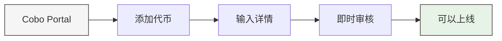

## 几分钟内在您的交易所上线新代币

以往，在交易所上线新代币需要与托管服务商进行冗长的邮件往来，以添加钱包支持。现在，通过 Cobo 的自助上币功能，您可以在几分钟内获得代币钱包支持，立即在交易所上线。

我们的自助上币功能让您能够独立地为各种生态系统添加新代币支持，包括 Ethereum、Solana、Optimism、Arbitrum、BNB Smart Chain 等。无论您是在扩展代币种类还是优化资源，现在都可以快速行动，在竞争激烈的市场中保持领先。

## 如何使用自助上币

<Info>
自助上币适用于：
- [全托管钱包](/cn/portal/custodial-wallets/asset-wallets/set-up)
- [MPC 钱包](/cn/portal/mpc-wallets/ocw/introduction)
</Info>

## 快速入门指南

1. 登录 [Cobo Portal](https://portal.cobo.com/login)
2. 导航至您的钱包：
   - 全托管钱包：点击  > **全托管钱包**
   - MPC 钱包：点击  > **MPC 钱包**
3. 选择您的钱包并点击**添加代币**
4. 如果未找到您想要的代币，点击**提交申请**
5. 在右侧与 **Cobo Global** 的聊天窗口中，点击**创建工单**
6. 填写代币详情：
   - 选择钱包类型
   - 选择区块链网络
   - 输入代币合约地址
7. 点击**创建工单**提交请求

在聊天窗口中跟踪请求状态。一旦获得批准（通常在几分钟内），您就可以在交易所开始上线该代币。

### 观看指南

<iframe
  width="700"
  height="400"
  src="https://embed.app.guidde.com/playbooks/xvvaKi45LZMjptbbkEXvpm"
  title="YouTube video player"
  frameborder="0"
  allow="accelerometer; autoplay; clipboard-write; encrypted-media; gyroscope; picture-in-picture"
  allowfullscreen
></iframe>

<Tip>欢迎[分享您的反馈](https://forms.zohopublic.com/cobo/form/DocumentFeedbackForm/formperma/QvLOhxJv1_JMsJ-1dleZ8Itb_7rzN-LtgvsDdxosoVI?referrername=manuals)，帮助我们改进文档！</Tip>
