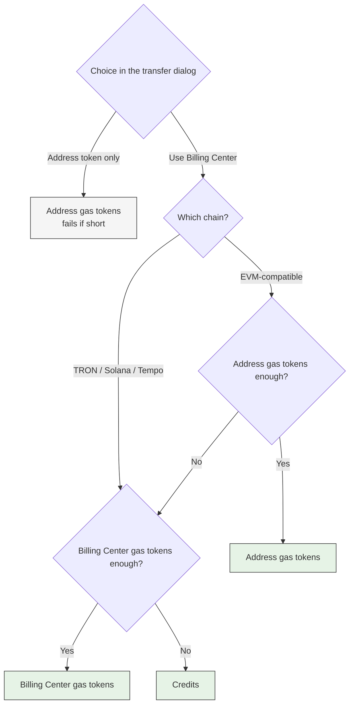

An on-chain fee can come from three places: gas tokens in the wallet address, gas tokens in Billing Center, and Credits in Billing Center. Which of the three is charged depends on your configuration; Portal transfers and API transactions are configured differently.

## Transfers initiated from Cobo Portal

The transfer dialog lets you choose what pays the fee — "Use Billing Center" or "Use the token in the wallet address only":

| Chain | Use Billing Center | Use the token in the wallet address only |
|---|---|---|
| EVM-compatible chains | Uses the address's gas tokens when they are enough; otherwise Billing Center pays | Uses the address's gas tokens only, and fails if they are insufficient |
| TRON, Solana, Tempo | **Billing Center pays directly; the address's gas tokens are never touched** | Uses the address's balance only, and fails if it is insufficient |

The choice **is made in each transfer's dialog and applies only to that transfer**; Billing Center has no global switch governing Portal transfers.

## Transactions initiated through the API

How the fee is paid is determined by the `auto_fuel` parameter in the request:

| Value | Behavior |
|---|---|
| `ProActiveAutoFuel` | Billing Center always pays, without touching the address's gas tokens |
| `PassiveAutoFuel` | Uses the address's gas tokens when they are enough; otherwise Billing Center pays. Not supported on TRON, Solana, or Tempo |
| `UsePortalPreference` | Follows the per-chain sponsorship rules configured in Settings |
| `DisableAutoFuel` | Never uses Billing Center; the address pays and the transaction fails if the balance is insufficient |

**When the parameter is omitted it defaults to `UsePortalPreference`**, which follows the Settings configuration. When another value is passed explicitly, the request decides and the page configuration is not read.

### The two settings under Advanced settings

In Billing Center, click the **Settings** tab and expand **Advanced settings**. Both of the following apply **only when an API transaction passes `UsePortalPreference`, or omits the parameter**:

- **Per-chain sponsorship rules**: set sponsorship per chain. EVM-compatible chains offer three options — use the wallet address only, sponsor when the address balance is short, or always sponsored by Billing Center. TRON, Solana, and Tempo offer only two: use the wallet address only, or sponsored by Billing Center.
- **Which balance to charge when sponsoring**: either "Gas tokens first, Credits when short" or "Gas tokens only"; with the latter, an API transaction on that chain fails when gas tokens fall short.

## One fee is paid in full by a single source

<Warning>
**When a source is not enough, the whole fee moves to the next source rather than being topped up.**

For example: the address holds 0.003 ETH and the transaction needs 0.005 ETH. Billing Center does not add the missing 0.002. It **pays the full 0.005**, and the 0.003 already in the address is left untouched.

The same holds inside Billing Center: that chain's gas tokens are charged first, and when they fall short Credits pay instead — the gas token balance is not spent first and topped up with Credits.
</Warning>

This matters for reconciliation: every fee in your transaction records is **tagged with exactly one payment source** — Paid with Credits, or Paid with gas token.

## Common questions

<AccordionGroup>
<Accordion title="The wallet address holds SOL. Why was it not used?">
On Solana and Tempo, as soon as a transfer goes through Billing Center, Billing Center pays the fee in full and the address's balance is never touched. This is not a fallback triggered by an insufficient balance — it is how these two chains always behave.

To spend the address's own balance, choose "Use the token in the wallet address only" in the transfer dialog. Note that this is all or nothing: nothing is sponsored, and the transaction fails outright if the address's balance is insufficient.
</Accordion>

<Accordion title="Can I charge fees to Credits only and leave gas tokens alone?">
There is no "Credits only" option. As long as Billing Center's gas token balance for that chain covers the fee, gas tokens are charged first.

If you want a chain's fees to come only from Credits, simply do not deposit gas tokens for that chain; its fees are then always paid with Credits.
</Accordion>

<Accordion title="I changed a per-chain sponsorship rule in Settings. Why did Portal transfers not change?">
That setting applies only to transactions initiated through the API. Portal transfers behave the same way per chain every time, and can only be changed individually in each transfer's dialog.
</Accordion>

<Accordion title="Why does each fee in my transaction records show only one payment source?">
Because one fee is paid in full by a single source — two sources never each cover part of it.
</Accordion>
</AccordionGroup>

