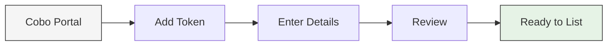

## Overview

The self-service token listing feature enables you to quickly add wallet support for tokens you want to list on your exchange, without going through back-and-forth email communications with customer support.

This feature supports multiple blockchain including Ethereum, Solana, Optimism, Arbitrum, BNB Smart Chain, and more.

## How it works

<Info>
Self-service token listing is available with:
- [Custodial Wallets](/en/portal/custodial-wallets/asset-wallets/set-up)
- [MPC Wallets](/en/portal/mpc-wallets/ocw/introduction)
</Info>

## Quick start guide

1. Log into [Cobo Portal](https://portal.cobo.com/login)
2. Navigate to your wallet:
   - For Custodial Wallets: Click  > **Custodial Wallets**
   - For MPC Wallets: Click  > **MPC Wallets**
3. Select your wallet and click **Add Token**
4. Click **submit a request** if your token isn't listed
5. In the chat window with **Cobo Global**, click **Create ticket**
6. Fill in the token details:
   - Select your wallet type
   - Choose the blockchain network
   - Enter the token contract address
7. Click **Create ticket** to submit your request

Track your request status in the chat window. Once approved (typically within minutes), you can start listing the token on your exchange.

## Watch the guide

<iframe
  width="700"
  height="400"
  src="https://embed.app.guidde.com/playbooks/xvvaKi45LZMjptbbkEXvpm"
  title="YouTube video player"
  frameborder="0"
  allow="accelerometer; autoplay; clipboard-write; encrypted-media; gyroscope; picture-in-picture"
  allowfullscreen
></iframe>

<Tip>Feel free to [share your feedback](https://forms.zohopublic.com/cobo/form/DocumentFeedbackForm/formperma/QvLOhxJv1_JMsJ-1dleZ8Itb_7rzN-LtgvsDdxosoVI?referrername=manuals) to improve our documentation!</Tip>
