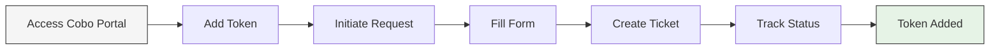

## Check the tokens and chains supported by Cobo Portal

<Note>Important: If you are using the Wallet-as-a-Service (WaaS) 2.0 API, refer to this [guide](https://www.cobo.com/developers/v2/api-references/wallets/list-supported-chains) for instructions on querying specific chain IDs and additional chain details, such as the required number of block confirmations. For token-specific information, please [click here](https://www.cobo.com/developers/v2/api-references/wallets/list-supported-tokens).</Note>

Cobo Portal currently supports over 80 blockchains and more than 3,000 tokens.

- To see the full list of tokens supported by Cobo Portal, [click](https://www.cobo.com/tokens) here.
- To see the full list of supported chains by Cobo Portal, [click](https://www.cobo.com/chains) here.

<Info>We regularly update these lists with new additions. If you want to request support for a specific chain or token, please [contact](https://www.cobo.com/contact) us. You can also request self-listing of tokens by following the instructions in the next section.</Info>

## Request self-listing for unsupported tokens

### Why request token self-listing?

The crypto ecosystem is dynamic, with new tokens emerging frequently. Our token self-listing feature empowers you to quickly add tokens that aren't yet supported by Cobo Portal. This feature is particularly valuable for:

- **Exchanges & Trading Teams**
  - Quickly list emerging tokens or trending assets (like meme coins) for time-sensitive trading opportunities
  - Maintain competitive advantage with fast token listing capabilities
  - Manage custom token portfolios efficiently

### How to request for token self-listing
For tokens that are not currently supported in Cobo Portal, we now offer a self-listing request feature that allows you to request the addition of new tokens.

Below is a quick overview of the process:

<Info>
Token self-listing is currently available for the following wallet types:
- [Custodial Wallets (Asset)](/en/portal/custodial-wallets/asset-wallets/set-up)
- [MPC Wallets (Organization-Controlled)](/en/portal/mpc-wallets/ocw/introduction)
</Info>

Watch our step-by-step guide:

<iframe
  width="700"
  height="400"
  src="https://embed.app.guidde.com/playbooks/xvvaKi45LZMjptbbkEXvpm"
  title="YouTube video player"
  frameborder="0"
  allow="accelerometer; autoplay; clipboard-write; encrypted-media; gyroscope; picture-in-picture"
  allowfullscreen
></iframe>

Let's walk through each step in detail:

#### Step 1: Access the token self-listing request form

<Info>We will use Custodial Wallets (Asset) as an example.</Info>
1. Log into [Cobo Portal](https://portal.cobo.com/login).
2. Click  > **Custodial Wallets** > **Asset Wallets**.
3. Click the wallet you would like to add a token to.
4. Click **Add Token**.
5. Find "If you cannot find a token, please submit a request for token self-listing." and click **submit a request**.
6. You will be redirected to a chat window with **Cobo Global**. Click **Create ticket** to open the **Request Token Self-Listing** form.

#### Step 2: Complete the Request Token Self-Listing form

Fill out the form with the following information:

1. Enter your email address:
   - Currently, your email address will have been automatically filled in. It will be used to send notifications about the status of your request

2. Select your wallet type:
   - [Custodial Wallets (Asset)](/en/portal/custodial-wallets/asset-wallets/set-up)
   - [MPC Wallets (Organization-Controlled)](/en/portal/mpc-wallets/ocw/introduction)

3. Choose the blockchain network (If the network you are looking for isn't listed, please [contact](https://www.cobo.com/contact) Cobo's customer support):
   - Ethereum
   - Solana
   - Base
   - Optimism
   - Arbitrum
   - BNB Smart Chain
   - Other chains (listed alphabetically)

4. Enter the token contract address
   - The system will validate the address
   <Note>
   The request will be rejected if:
   - The token contract already exists in the wallet
   - The token contract address is invalid
   </Note>

5. Click **Create ticket**
   - Click **Create ticket**. You'll be redirected to a confirmation window displaying **Ticket is created** along with relevant details such as the Ticket ID, selected wallet type, blockchain network, and token contract address.

6. Click **&lt;** to return to the chat box and check your request status.

#### Step 3: Track your request status

- You will receive automatic replies through both the chat box and email notifications notifying you of the request result. Once approved, you will be able to see your newly added token in your wallet.

<Tip>Feel free to [share your feedback](https://forms.zohopublic.com/cobo/form/DocumentFeedbackForm/formperma/QvLOhxJv1_JMsJ-1dleZ8Itb_7rzN-LtgvsDdxosoVI?referrername=manuals) to improve our documentation!</Tip>